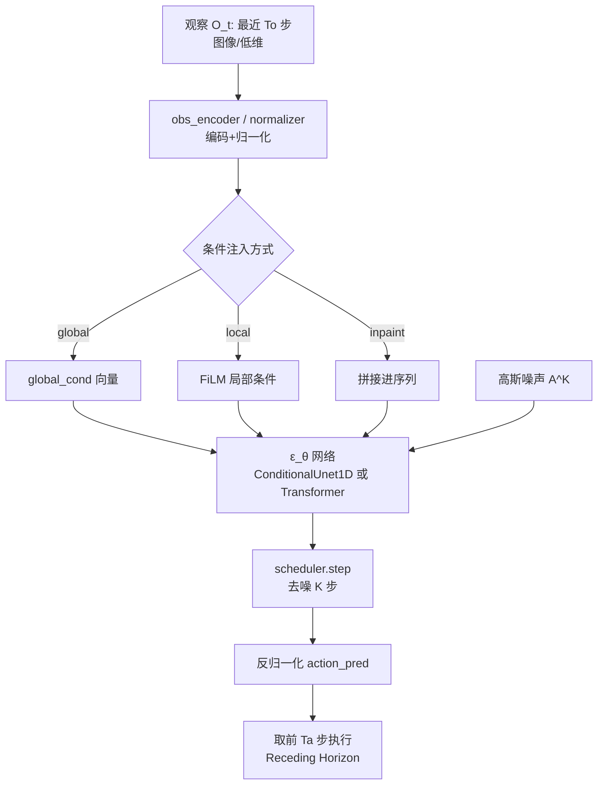

# Diffusion Policy Method 部分创新解读（论文 ↔ 代码对照）

> 对应论文 `paper/text/method.tex`（`\section{Diffusion Policy Formulation}`、
> `\section{Key Design Decisions}`、`\section{Intriguing Properties...}`）。
> 本文把论文的每个创新点，对照到仓库里对应的代码实现。

---

## 1. 总体思想：把「策略」建模成「条件扩散模型」

论文核心公式（method.tex 的 `eq:diffusion_policy_langevin`）：

$$
\mathbf{A}^{k-1}_t = \alpha\Big(\mathbf{A}^k_t - \gamma\,\epsilon_\theta(\mathbf{O}_t, \mathbf{A}^k_t, k) + \mathcal{N}(0,\sigma^2 I)\Big)
$$

即：**动作序列 $\mathbf{A}_t$ 不是直接回归出来的，而是从高斯噪声出发，经过 $K$ 步「去噪」逐步精炼得到的**。每一步都是对「分数函数」$\nabla_{\mathbf{a}}\log p(\mathbf{a}|\mathbf{o})$ 的一次 Langevin 动力学更新。

对应代码（三个 policy 文件里的 `conditional_sample`）：

```python
trajectory = torch.randn(size=condition_data.shape, ...)   # 从高斯噪声初始化 A^K
for t in scheduler.timesteps:                               # K 步去噪
    trajectory[condition_mask] = condition_data[condition_mask]  # 强制条件
    model_output = model(trajectory, t, local_cond, global_cond) # ε_θ(O_t, A^k_t, k)
    trajectory = scheduler.step(model_output, t, trajectory, ...).prev_sample  # A^{k-1}
```

- 文件：`policy/diffusion_unet_lowdim_policy.py`、`policy/diffusion_unet_image_policy.py`、`policy/diffusion_transformer_lowdim_policy.py`。
- 噪声调度来自 `diffusers.schedulers.scheduling_ddpm.DDPMScheduler`（配置见各 `config/*.yaml` 的 `noise_scheduler`）。

---

## 2. 创新点一：把 DDPM 的输出改为「动作序列」（而非图像）

论文原文（method.tex §Diffusion for Visuomotor Policy Learning）：

> "changing the output $\mathbf{x}$ to represent robot actions."

传统 DDPM 生成的是图像 $\mathbf{x}$；Diffusion Policy 让它生成**未来 $T_p$ 步的动作序列** $\mathbf{A}_t \in \mathbb{R}^{T_p \times D_a}$。训练目标（`eq:diffusion_policy_loss`）：

$$
\mathcal{L} = \mathrm{MSE}\big(\epsilon^k,\ \epsilon_\theta(\mathbf{O}_t, \mathbf{A}^0_t + \epsilon^k, k)\big)
$$

代码对应（`compute_loss`）：

```python
noise = torch.randn(trajectory.shape, ...)                       # ε^k
timesteps = torch.randint(0, num_train_timesteps, (bsz,), ...)   # 随机采样 k
noisy_trajectory = noise_scheduler.add_noise(trajectory, noise, timesteps)  # A^0 + ε^k
pred = model(noisy_trajectory, timesteps, ...)                   # ε_θ 预测
loss = F.mse_loss(pred, target)                                  # target=noise
```

---

## 3. 创新点二：闭环动作序列预测（Receding Horizon Control）

论文原文：

> "we commit to the action-sequence prediction ... for a fixed duration before replanning."
> 每 $t$ 步输入最近 $T_o$ 步观察，预测 $T_p$ 步动作，**只执行其中 $T_a$ 步**，然后再重新规划。

这带来三个好处（论文 §Benefits of Action-Sequence Prediction）：

1. **时间一致性（Temporal action consistency）**：整段序列由同一个扩散过程采样，相邻动作不会在多个 mode 之间来回跳（对比 BET/BC-RNN 逐步独立采样）。
2. **对空闲动作（idle actions）鲁棒**：演示数据里的停顿不会让单步策略卡死。
3. **对抗延迟**：预测未来多步，天然抵消图像处理/推理/网络延迟。

代码对应（`predict_action` 的尾部，取序列的一段）：

```python
start = To            # 低维 CNN 用 To；图像/Transformer 用 To-1
end   = start + self.n_action_steps
action = action_pred[:, start:end]   # 只取 Ta 步执行
```

- 超参：`config/*.yaml` 中 `horizon=16`（$T_p$）、`n_obs_steps=2`（$T_o$）、`n_action_steps=8`（$T_a$）。
- 论文消融结论：$T_a=8$ 在大多数任务上最优（Fig. ablation 左图）。
- 还可以用「前一步预测的剩余动作 warm-start」来进一步提升平滑（`past_action_visible`）。

---

## 4. 创新点三：只建模条件分布 $p(A_t | O_t)$，而非联合分布

论文原文：

> "We use a DDPM to approximate the conditional distribution $p(\mathbf{A}_t|\mathbf{O}_t)$ instead of the joint distribution $p(\mathbf{A}_t,\mathbf{O}_t)$ used in Diffuser."

好处：无需在扩散过程中同时「推断未来状态」，因此**推理更快**、生成动作更准，也使得**视觉编码器可以端到端训练**。

代码中三种条件注入方式（对应论文 Fig.1b/c）：

| 方式                                | 含义                                                        | 代码开关                                               |
| ----------------------------------- | ----------------------------------------------------------- | ------------------------------------------------------ |
| **Global conditioning（全局条件）** | 观察编码成单个向量，与扩散步 embedding 拼一起注入每个 block | `obs_as_global_cond=True`（图像策略默认，论文主推）    |
| **Local conditioning（FiLM）**      | 观察序列作为局部特征，用 FiLM 调制每个卷积层                | `obs_as_local_cond=True`（低维策略）                   |
| **Inpainting conditioning**         | 把观察拼在动作序列后面一起扩散，训练时 mask 掉未知部分      | `obs_as_local_cond=False and obs_as_global_cond=False` |

代码对应：

- 图像策略 `diffusion_unet_image_policy.py`：观察 → `obs_encoder` → `global_cond`（`(B, obs_feature_dim * To)`）。
- 低维策略 `diffusion_unet_lowdim_policy.py`：支持 local/global/inpainting 三种。
- FiLM 的实现：`model/diffusion/conditional_unet1d.py` 的 `ConditionalResidualBlock1D`（`scale * out + bias`）。

---

## 5. 创新点四：两种骨干网络（CNN vs Transformer）

### 5.1 CNN-based（1D 时序 U-Net）

论文原文（§Network Architecture Options）：

> 采用 Diffuser 的 1D temporal CNN，改进：(1) 用 FiLM 注入观察与扩散步 k；(2) 只预测动作而非 obs+action；(3) 移除 inpainting-based goal conditioning（改用 FiLM）。

代码：`model/diffusion/conditional_unet1d.py`（`ConditionalUnet1D`）。

- `down_dims` 逐层下采样、`mid_modules` 瓶颈、`up_modules` 逐层上采样 + skip connection。
- 每个 `ConditionalResidualBlock1D` 内部通过 `cond_encoder`（MLP）把 `[扩散步 embedding, 观察特征]` 变成 per-channel scale/bias（FiLM）。
- 论文结论：CNN 骨干「开箱即用」好，但**在动作快速/剧烈变化时（如速度控制）表现差**，因为时序卷积偏好低频信号（over-smoothing）。

### 5.2 Time-series Diffusion Transformer

论文原文：

> 采用 minGPT 的 transformer decoder；噪声动作序列作为输入 token；扩散步 k 的正弦 embedding 作为第一个 token；观察经共享 MLP 变成 embedding 序列作为 cross-attention 的 memory。

代码：`model/diffusion/transformer_for_diffusion.py`（`TransformerForDiffusion`）。

- `input_emb` 把动作 token 映射到 $n_{emb}$ 维；`pos_emb` 可学习位置编码。
- `time_emb`（正弦）作为条件序列的第一个 token；若 `obs_as_cond`，观察 token 也拼进条件序列。
- decoder 使用 `causal_attn` mask（每个动作 token 只能看自己与之前的 token，对应论文 Fig.1c 的 mask）。
- 观察特征通过 `cond_obs_emb` 线性层 → 作为 decoder 的 `memory` 做 cross-attention。
- 论文结论：Transformer 在**任务复杂、动作变化快**时更强，但对超参更敏感（`n_layer`、`n_head`、`n_emb` 等）。

---

## 6. 创新点五：视觉编码器设计

论文原文（§Visual Encoder）：

> 每个相机用独立 encoder，每帧独立编码后拼接。用 ResNet-18（无预训练），改两处：
>
> 1. 全局平均池化 → **空间 softmax 池化**（保留空间信息，来自 RoboMimic）；
> 2. **BatchNorm → GroupNorm**（配合 EMA 训练更稳）。

代码：`model/vision/multi_image_obs_encoder.py`（`MultiImageObsEncoder`）。

- `rgb_model` 每个相机独立（`share_rgb_model=False`），也可共享。
- `use_group_norm=True`：`replace_submodules` 把所有 `BatchNorm2d` 换成 `GroupNorm`。
- `crop_shape=[76,76]` + `random_crop=True`：训练时随机裁剪；测试时中心裁剪。
- `imagenet_norm=True`：输入 `[0,1]` 用 ImageNet 均值方差归一化。
- ResNet 构造在 `model/vision/model_getter.py`（`get_resnet(name='resnet18', weights=None)`）。
- 论文消融（§Ablation）：端到端训练 > 冻结预训练 > 从零训练 ViT；微调 CLIP ViT-B/16 可到 98%。

---

## 7. 创新点六：噪声调度（Square Cosine Schedule）

论文原文（§Noise Schedule）：

> 经验上 **iDDPM 的 Square Cosine Schedule** 在控制任务上效果最好。

代码对应：`noise_scheduler.beta_schedule=squaredcos_cap_v2`（见 `config/*.yaml`），
`beta_start=0.0001`、`beta_end=0.02`、`num_train_timesteps=100`。

---

## 8. 创新点七：DDIM 加速推理（实时控制）

论文原文（§Accelerating Inference for Real-time Control）：

> 用 **DDIM** 解耦训练与推理的去噪步数：训练 100 步、推理只用 10 步，在 3080 上达到 0.1s 推理延迟。

代码对应：`num_inference_steps` 可独立于 `num_train_timesteps` 设置；
`DDPMScheduler.step` 在 `scheduler.timesteps`（`set_timesteps(num_inference_steps)`）上迭代，
当 `num_inference_steps < num_train_timesteps` 时即等价于 DDIM 跳步采样。

---

## 9. 创新点八（性质）：多模态、位置控制、训练稳定性

论文 §Intriguing Properties 的三个性质，都源于「预测分数函数而非能量」：

1. **多模态动作分布**：每次采样从不同高斯噪声出发（stochastic initialization），加上 Langevin 迭代的随机扰动，能自然落入不同 mode 并 commit 到某一个（对比 LSTM-GMM 偏向一侧、BET 无法 commit）。
2. **与位置控制协同**：位置控制下多模态更强、累积误差更小，Diffusion Policy 恰好能利用这两点（对比 BC-RNN/BET 用位置控制反而下降）。
3. **训练稳定性**：DDPM 建模的是**分数函数** $\nabla_\mathbf{a}\log p(\mathbf{a}|\mathbf{o})$，不涉及归一化常数 $Z(\mathbf{o},\theta)$，因此避开了 IBC（EBM）的 InfoNCE 负采样不稳定问题。

代码层面对应：训练用 `MSE(ε, ε_θ)`（`compute_loss`），推理用 `scheduler.step`（Langevin），全程不计算归一化常数。

---

## 10. 一张图总结「一次推理」的完整流程



---

## 11. 对应到复现实验：哪些创新点最关键

复现 Push-T / RoboMimic 时，真正起作用的「配方」就是这几个超参 + 结构：

| 创新点             | 在配置中的位置                                | 默认值                  |
| ------------------ | --------------------------------------------- | ----------------------- |
| 动作序列长度 $T_p$ | `horizon`                                     | 16                      |
| 观察/执行步数      | `n_obs_steps` / `n_action_steps`              | 2 / 8                   |
| 扩散步数           | `num_train_timesteps`                         | 100                     |
| Square Cosine 调度 | `beta_schedule`                               | `squaredcos_cap_v2`     |
| CNN 骨干           | `down_dims`, `kernel_size`, `n_groups`        | `[512,1024,2048]`, 5, 8 |
| 视觉编码器         | `obs_encoder` (ResNet-18, GroupNorm, crop 76) | —                       |
| EMA                | `use_ema`                                     | True                    |
| 学习率/调度        | `optimizer.lr`, `lr_scheduler`                | 1e-4, cosine+500 warmup |

这些与论文 Table I/II 的 46.9% 平均提升直接对应。
